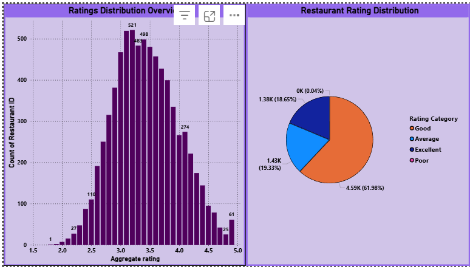
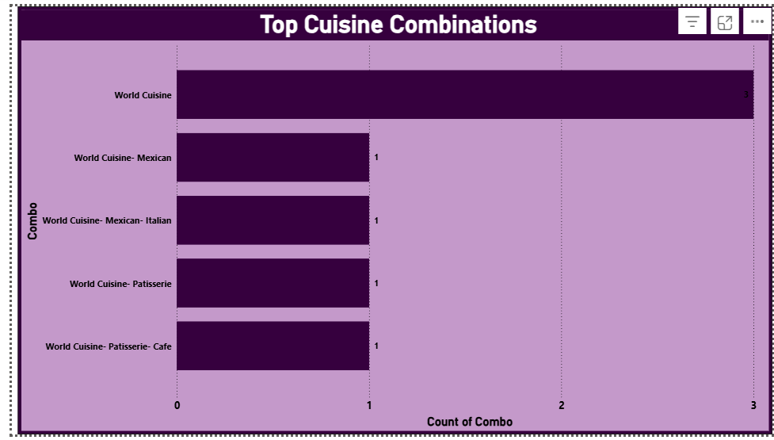
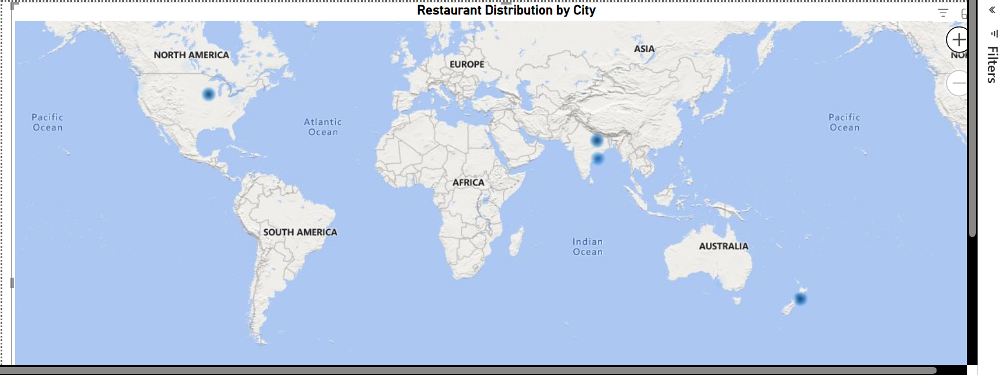
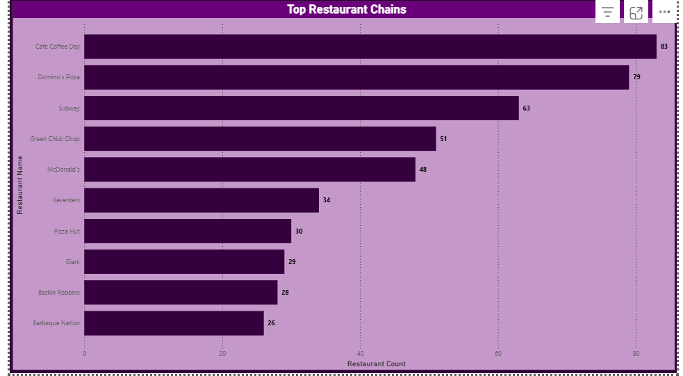

# 🍽️ Level 2 - Restaurant Analysis Dashboard

## 📊 Project Overview

This Power BI dashboard analyzes restaurant data to extract insights about ratings, cuisine combinations, geographic distribution, and restaurant chains.

---

## 🔹 Task 1: Rating Analysis

* Distribution of restaurant ratings
* Categorization into Good, Average, Poor, Excellent

## 🔹 Task 2: Cuisine Combination Analysis

* Identifies most common cuisine pairings
* Shows diversity of restaurant offerings

## 🔹 Task 3: Geographic Analysis

* Map visualization using latitude & longitude
* Highlights restaurant distribution across regions

## 🔹 Task 4: Restaurant Chain Analysis

* Identifies top restaurant chains
* Shows brands with multiple outlets

---

## 🛠 Tools Used

* Power BI
* Data Cleaning (Power Query)
* DAX Measures

---

## 📌 Conclusion

The analysis highlights key trends in restaurant distribution, customer preferences, and market dominance of popular chains.

---
